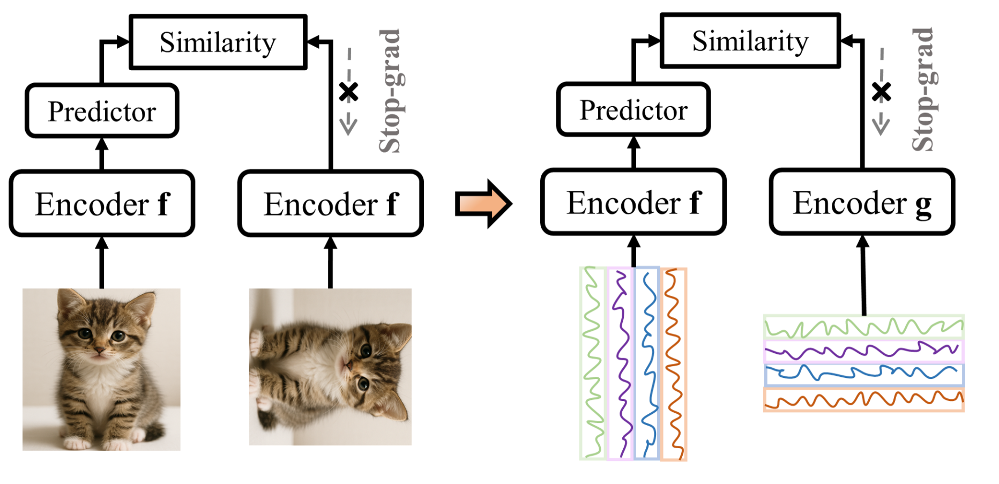
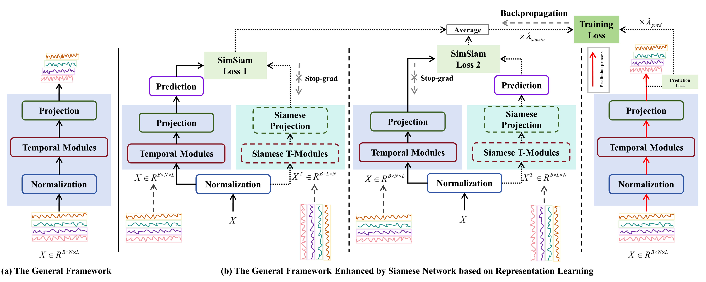
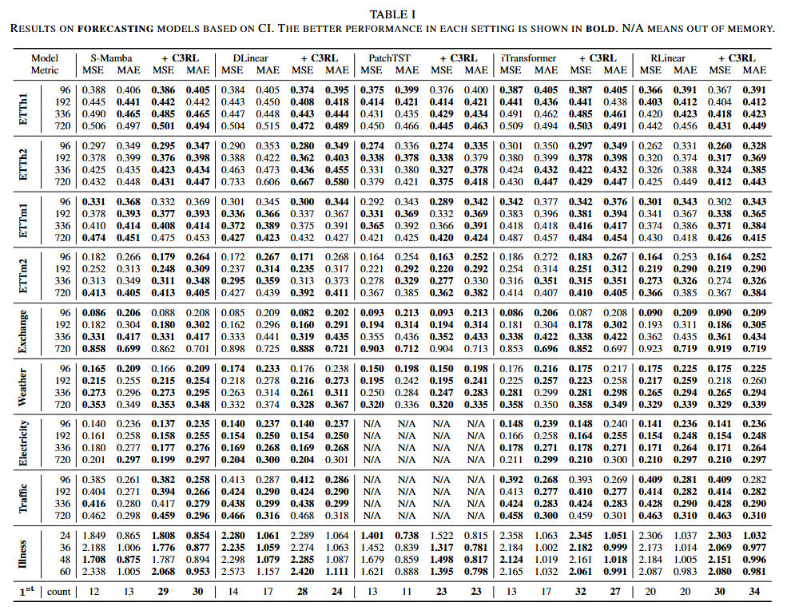
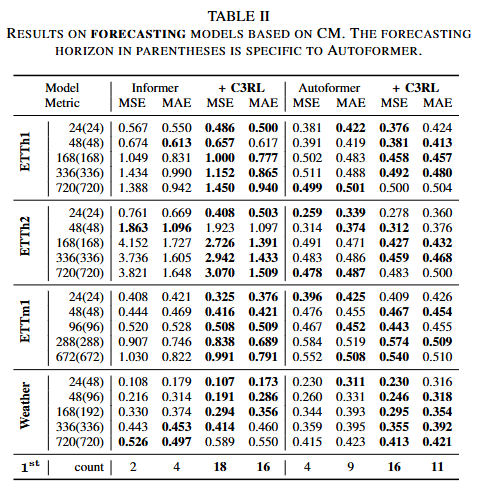
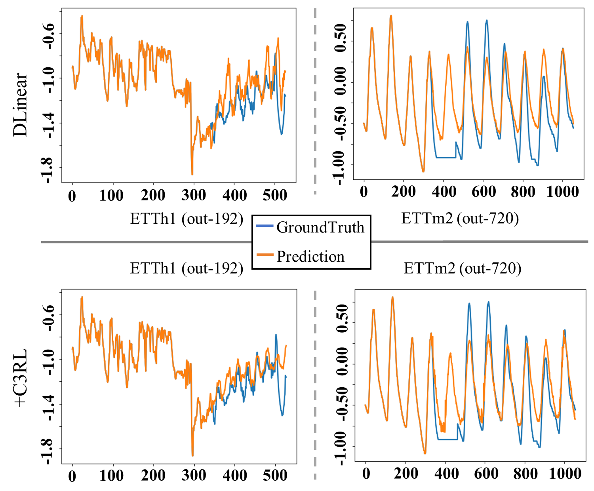
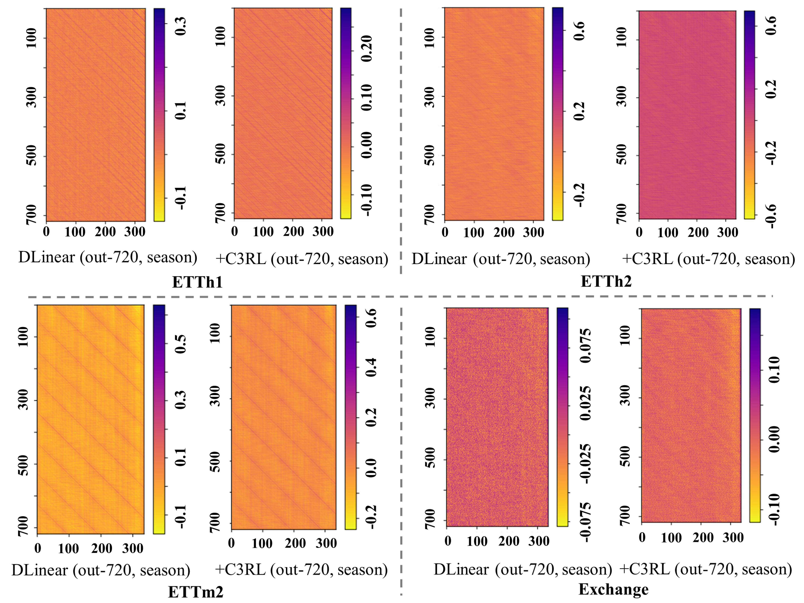

# C3RL: Rethinking the Combination of Channel-independence and Channel-mixing from Representation Learning (AAAI 2026)
This repo is the official Pytorch implementation of 
[C3RL: Rethinking the Combination of Channel-independence and Channel-mixing from Representation Learning](https://arxiv.org/pdf/2507.17454?/)

## C3RL (Motivation and Core Idea)
Multivariate Time Series Forecasting (MTSF) is widely applied in real-world scenarios such as energy, traffic, and healthcare. Existing forecasting models typically adopt one of two input processing strategies:
- Channel-Mixing (CM): captures inter-variable dependencies but overlooks variable-specific temporal patterns.
- Channel-Independence (CI): models each variable separately but underutilizes cross-variable interactions.
Although recent studies attempt to combine CM and CI via feature fusion, these approaches mainly focus on prediction accuracy and often suffer from limited generalization and weak representation learning ability.

We rethink the combination of CM and CI from a representation learning perspective and propose C3RL, a unified framework that:

- Treats CM and CI inputs as transposed views of the same time series.
- Aligns their representations through contrastive learning.
- Enhances forecasting performance via joint optimization.

## C3RL (Framework)
C3RL adopts a SimSiam-inspired siamese architecture:

- Two branches process the same time series using different channel strategies.
- One branch serves as the backbone, while the other acts as a siamese encoder.
- A stop-gradient mechanism prevents representation collapse without negative samples.

C3RL jointly optimizes representation learning and forecasting performance:

- Contrastive loss aligns CM and CI representations.
- Prediction loss ensures forecasting accuracy.
- Adjustable weighting balances the two objectives dynamically.

## Quantitative and Qualitative Results
Results on forecasting models based on CI:


Results on forecasting models based on CM:


Visualization of the predictive performance:


Visualization of the weights of DLinear on several datasets:


## Citing
If you find this repository useful for your work, please consider citing it as follows:

```BibTeX
@inproceedings{ma2026c3rl,
  title={{C3RL: Rethinking the Combination of Channel-independence and Channel-mixing from Representation Learning}},
  author={Ma, Shusen and Zhao, Yunbo and Kang, Yu},
  booktitle={Proceedings of the AAAI Conference on Artificial Intelligence},
  volume={40},
  number={29},
  pages={24281--24289},
  year={2026}
}
```

Please remember to cite all the datasets and compared methods if you use them in your experiments.

## Acknowledgement
We appreciate the following GitHub repos a lot for their valuable code and efforts.

DLinear (https://github.com/cure-lab/LTSF-Linear)

Informer (https://github.com/zhouhaoyi/Informer2020)
